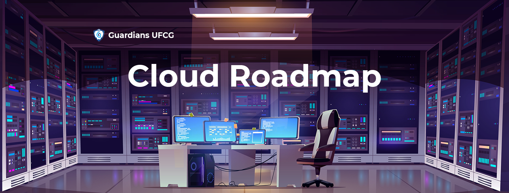

     
Esse roadmap é voltado para quem busca conhecimentos em administração de cloud privada.

## Como tirar melhor proveito desse Roadmap
1. **Esse roadmap não é uma bíblia**: Esse material é pensado para ser usado como referência, mas não deixe de ver assuntos que te interessaram por que não estão aqui ou ver algo só porque está aqui mesmo você não enxergando sentido para suas atividades e não sentindo interesse.
2. **Disciplina**: Não adianta você engolir duas sessões desse conteúdo e nunca mais olhar nada, vá devagar e sempre, mantenha uma frequência regular de estudos sobre os tópicos aqui listados.
3. **Você não tem memória fotográfica**: Então, de vez em quando é bom voltar uns passos e relembrar com mais detalhes o que foi visto.

## Roadmap

## Recursos

Aqui você irá encontrar nossas recomendações de material para estudar os assuntos citados no roadmap.

[1. Conceitos de Programação](https://github.com/Guardians-DSC/Cloud-Roadmap/tree/main/1.%20Conceitos%20de%20programa%C3%A7%C3%A3o)\
[2. Conceitos de Sistemas Operacionais](https://github.com/Guardians-DSC/Cloud-Roadmap/tree/main/2.%20Conceitos%20de%20sistemas%20operacionais)\
[3. Operação de Sistemas Operacionais](https://github.com/Guardians-DSC/Cloud-Roadmap/tree/main/3.%20Opera%C3%A7%C3%A3o%20de%20sistemas%20operacionais)\
[4. Terminal](https://github.com/Guardians-DSC/Cloud-Roadmap/tree/main/4.%20Terminal)\
[5. Redes](https://github.com/Guardians-DSC/Cloud-Roadmap/tree/main/5.%20Redes)\
[6.1 Monitoramento de Infraestrutura](https://github.com/Guardians-DSC/Cloud-Roadmap/tree/main/6.1%20Monitoramento%20de%20infraestrutura)\
[6.2 Conceitos de Cloud Computing](https://github.com/Guardians-DSC/Cloud-Roadmap/tree/main/6.2%20Conceitos%20de%20cloud%20computing)\
[6.3 IAAS](https://github.com/Guardians-DSC/Cloud-Roadmap/tree/main/6.3%20IAAS)\
[7. Gerenciadores de Clouds](https://github.com/Guardians-DSC/Cloud-Roadmap/tree/main/7.%20Gerenciador%20de%20clouds)

## Contribua

Viu algo que dá pra melhorar algo? Por favor, faça um pull request com as suas ideias. Você também pode olhar a parte de [issues](https://github.com/Guardians-DSC/Cloud-Roadmap/issues) para ajudar a melhorar o projeto.

## Agradecimentos

O grupo Guardians dá seus mais sinceros agradecimentos para [Kaio Oliveira](https://github.com/kaiokmo), [Marta Laís](https://github.com/martalais) e [Reinaldo Gomes]() que se dedicaram a construir esse roadmap e participar do episódio ["Chama o Suporte 16 - Cloud Roadmap"]() comentando o Roadmap.
